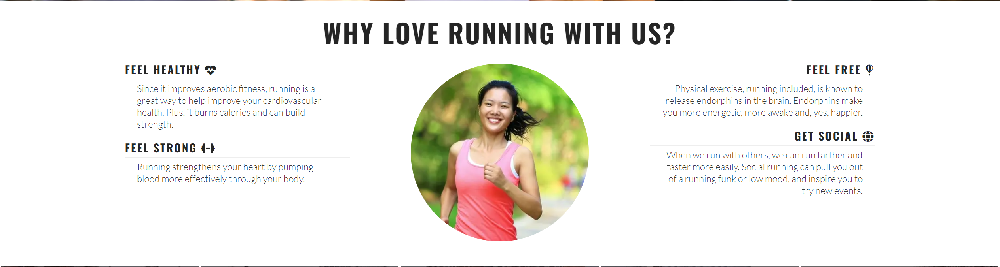

# Love Running
This website is designed for people who are interested in joining a running club where runners meet to run on a regular basis. There are other added advantages of being socialized and physically fit which is the main goal of this site.

## Technology
HTML and CSS are used in creating this site.

## Features

Contained within this site are features which have been added to for more readability  and as listed below.

- Navigation

   - Featured at the top of the page, the navigation shows the club name in the top left corner: 'LOVE RUNNING' which links to the top of the page.

   - To the top right corner are the other navigation links: Home, Gallery and Sign up which link to different sections of the page.

   - The navigation tells about links in the website and inform the users the name of the club and website makes different sections information easy to find.

  

- Home page image
  - b

- Club Ethics Section
  
  - The ethic section will allow the users to see the advantages associated with being a member of this club

- Meetup Times section

  - This session tells the user on schedule in which the runnning activity actually takes place.

- Footer seesion

  - the

- Gallery

  - 

- The Sign Up Page

  - The sign up page tells the users on how to register to be a member of the club. It also inform users to decide if they would like to make part in road, trail or both. Users will provide their details in the input field and get it submitted.

- Testing

  - Validation test was carried out on Home, Gallery and Sign up HTML using HTML validator and CSS using css validator.

- Validator Testing

  - HTML

    - No error return after validation when passing through the official 

  - CSS

    - No error return after validation when passing through the official

