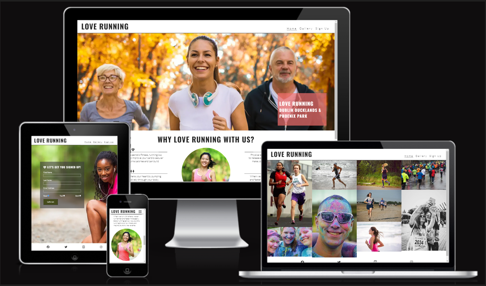
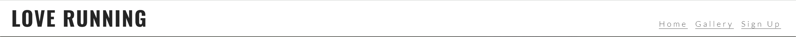
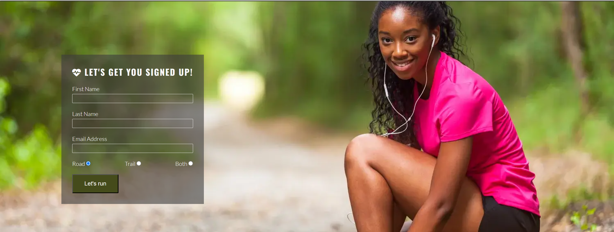

# Love Running
This website is designed for people who are interested in joining a running club where runners meet to run on a regular basis. There are other added advantages of being socialized and physically fit which is the main goal of this site.

## Technology
HTML and CSS are used in creating this site.

## Features

Contained within this site are features which have been added to for more readability  and as listed below.

- Navigation

   - Featured at the top of the page, the navigation shows the club name in the top left corner: 'LOVE RUNNING' which links to the top of the page.

   - To the top right corner are the other navigation links: Home, Gallery and Sign up which link to different sections of the page.

   - The navigation tells about links in the website and inform the users the name of the club and website makes different sections information easy to find.

  

- Home page image

  - The front page contains an image of runners which is intended to capture the mind of the users.

- Club Ethics Section
  
  - The ethic section will allow the users to see the advantages associated with being a member of this club

- Meetup Times section

  - This session tells the user on meetup schedule in which the runnning exercise would actually takes place.
  - Also the meetup location and the time.

- Footer seesion

  - Contained within the footer session are the social medial links which create more avenue for the users to keep connected. This social media links will open to a new tab for easy navigation.

- Gallery

  - Within the gallery are the pictures which tells the users more about the organization looks like and what they do.

- The Sign Up Page

  - The sign up page tells the users on how to register to be a member of the club. It also inform users to decide if they would like to make part in road, trail or both. Users will provide their details in the input field and get it submitted.

- Testing

  - I tested this page works well in different browsers: Google Chrome, Microsoft Edge, and Moxila Fire Fox.

  - I confirmed that the project is responsive and functions well on different sreen sizes. 

  - Validation test was carried out on Home, Gallery and Sign up HTML using HTML validator and CSS using css validator.

  - I confirmed that the sign up page check and test was carried out, the users first name, last name are required and only email address is required in the email input field.

- Validator Testing

  - HTML

    - No error return after validation when passing through the official <a href="https://validator.w3.org/nu/?doc=https%3A%2F%2Fadeniyiolusola.github.io%2Flove-running%2F">W3C validator</a>

  - CSS

    - No error return after validation when passing through the official <a href="https://jigsaw.w3.org/css-validator/validator">(Jigsaw) validator</a>

- Bugs

  - No bug is left unfixed

## Deployment

- The site was deployed to GitHub pages. The steps to deploy are as follows:
  - In the GitHub repository, navigate to the Settings tab
  - From the source section drop-down menu, select the Master Branch
  - Once the master branch has been selected, the page will be automatically refreshed with a  detailed ribbon display to indicate the successful deployment.
  - The live link can be found here - https://adeniyiolusola.github.io/love-running/

## Credits

  - This project was created as one of the requirements forming portfolio project 1 essential in my learning process at Code Institute in become a Full Stack Developer. All ideas and concepts are referenced from Code Institute LM. 

### Content 

  - Texts for this project are taken Love Running project tutorial in code institute LM.
  - Form validation was implementation instruction was followed step by step in Code Institute LM.
  - The icons in the footer were taken from <a href="https://fontawesome.com/">Font Awesome</a>

### Media

  - The images used were all taken from Love Running project tutorial in code institute LM.

